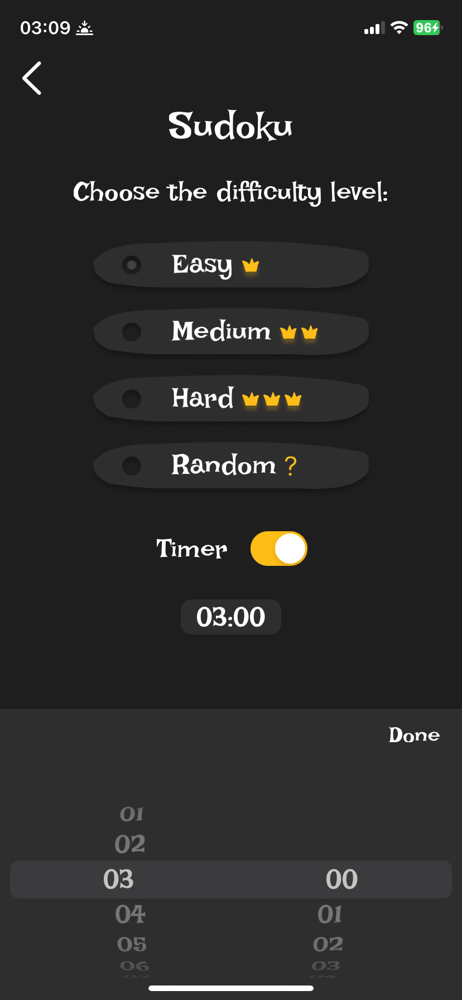

Crowns
=
Crown – мобильное приложение-игра на iOS.
-

[Ссылка](https://apps.apple.com/ru/app/crowns-cats-vs-mice/id6748743484) на приложение в App Store.
-

Основной экран **Home**
-

Главный экран, на котором пользователь может начать новую игру или посмотреть обучение по играм.
Календарь отображает дни, когда были выполнены челленджи.

    
    
    

Экраны **Game settings**.
-

Для каждой игры можно выбрать уровень сложности и настроить таймер.

    
    

Игровой процесс **Crowns**.
-

Цель игры: расставить 9 корон на поле так, чтобы они не находились в одном столбце, строке и цветной области.
Также короны не могут соседствовать по диагонали.

Основной функционал:
- взаимодействие с игровым полем
- пауза
- таймер с прямым/обратным отсчетом
- подсказка
- ход назад
- обучение

    

Игровой процесс **Killer-sudoku**.
-

Цель игры: решить судоку с учетом специальных зон с суммами.

Основной функционал:
- установка цифры в клетке
- очистка клетки
- пауза
- таймер с прямым/обратным отсчетом
- подсказка
- ход назад
- обучение
- отображение некорректного хода

    

**Конец игры**.
-

По завершении игры пользователь видит информацию о победе или поражении и о потраченном времени.
Пользователь может перейти в раздел статистики или вернуться на главный экран.

    
    

Уведомление о **Незаконченной игре**.
-

Если пользователь вышел из игры, не закончив ее, она сохраняется, после чего к ней можно вернуться с сохранением прогресса. Сохранение прогресса не действует на игры челленджей.
Пользователь может не продолжать незаконченную игру, тогда прогресс удалится.

    
    

**Обучение**.
-

Для каждой игры представлено обучение, описывающее правила.

    
    

Основной экран **Challenges**.
-

На экране пользователь может начать новый челлендж Crowns или Killer-sudoku. Они доступны раз в день и обновляются в 00:00. Также есть календарь с отметками дней, когда был пройден челлендж и текущим страйком.

    
    

Основной экран **Profile**.
-

На экране профиля пользователь может добавить свое имя и аватар. Также отсюда можно перейти в разделы статистики и разработчика.

    

**Статистика по играм**.
-

Для каждого типа игр хранится статистика, которую пользователь может посмотреть.

    
    

Экран **О разработчике**.
-

На этом экране указана некоторая информация о разработчике и добавлены контакты для связи.

    

