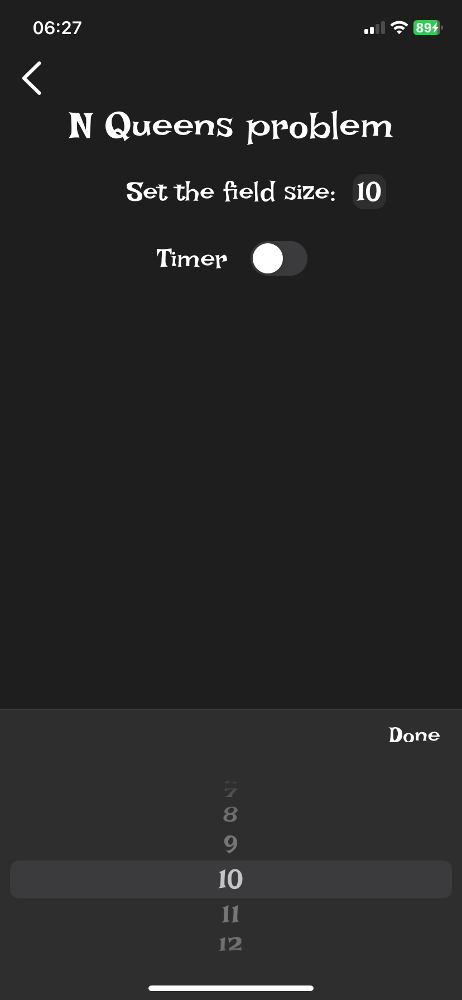

Crowns
=
Crown – мобильное приложение-игра на Swift (UIKit, Xcode) с архитектурой SVIP.
-


Основной экран - **Home**. Добавлен FSCalendar и кнопки для начала игры и обучения.

<div style="display: flex; justify-content: space-between;">
    
    
    
</div>


Основной экран **Challenges**. Добавлены кнопки для прохождения ежедневных испытаний и календарь для отражения прогресса. Также добавлены элементы анимации.

<div style="display: flex; justify-content: space-between;">
    
</div>

Экраны **Settings** для трех видов игр.

Экран для настройки игры "Crowns". Пользователю предлагается выбрать уровень сложности 
игры и добавить по желанию таймер для ограничения времени прохождения уровня.
<div style="display: flex; justify-content: space-between;">
    
    
</div>
Экран для настройки игры "Killer-sudoku", содержит аналогичный функционал, что и
экран для "Crowns".
<div style="display: flex; justify-content: space-between;">
    
</div>
Экран для игры в "N Queens" содержит текстовое поле для настройки размера игрового поля и таймер.
<div style="display: flex; justify-content: space-between;">
    
    
</div>

Установка и использование проекта
-
### Требования
- macOS с установленным Xcode (версия 15.0 или новее)
- Swift и UIKit

### Установка
1. **Клонируйте репозиторий или скачайте по кнопке <>Code → DownloadZIP**  
   ```sh
   git clone https://github.com/pshen0/Crowns.git
    ```
2. **Перейдите в нужную папку**
    ```sh
    cd path/Crowns
    ```
3. **Откройте проект в Xcode**
    ```sh
    open Crowns.xcodeproj
    ```
4. **Соберите и запустите проект в Xcode**
    Выберите симулятор или подключенное устройство
    Нажмите Cmd + R или Run в Xcode
